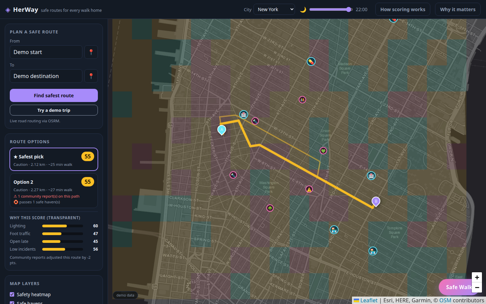
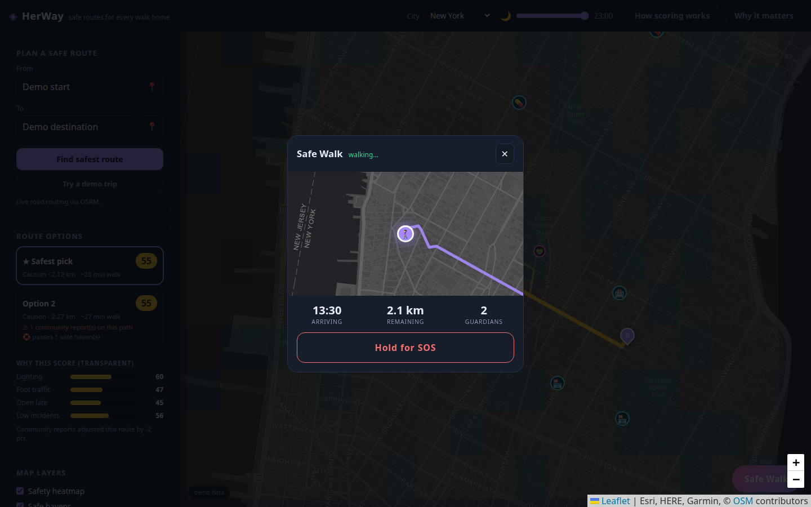
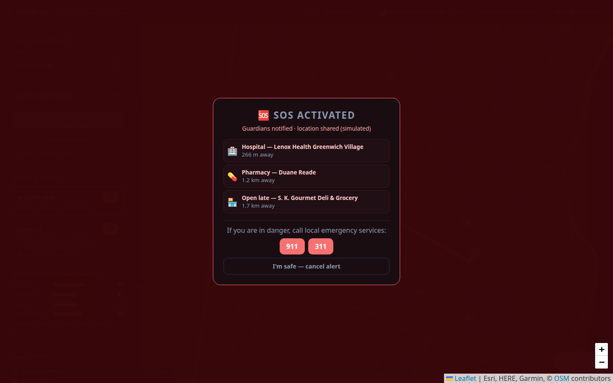

# ◈ HerWay

**Not the fastest way home — the safest one.**

HerWay is a safety-aware walking route planner built for the
**Acodemic X G.I.R.L.S. Global SDG Hackathon**, aligned with
**UN SDG 5 (Gender Equality)** and **SDG 11 (Sustainable Cities & Communities)**.



## Inspiration

9 in 10 women in cities worldwide report experiencing street harassment — and for
most, it quietly dictates which streets they walk, when they leave, and whether
they go out at all. Navigation apps optimize for *speed*. Nobody optimizes for
*feeling safe*.

HerWay asks a different question: **what if the map knew which streets are dark,
deserted, or flagged by the community — and routed around them?**

## What it does

- 🗺️ **Safety-scored routing** — pick start & destination; HerWay fetches real
  walking routes (OSRM) and ranks each by a transparent **Safety Score (0–100)**.
- 🌙 **Time-of-day aware** — a slider rescales factor weights live: lighting
  dominates at night, foot traffic by day. The same street scores differently at
  2pm vs 2am.
- 📍 **Community reports** — drop a pin to flag *poorly lit*, *harassment*,
  *isolated*, *feels safe*… reports persist and re-score nearby streets.
- 🛟 **Safe havens** — live OpenStreetMap data (Overpass API) surfaces police
  stations, hospitals, pharmacies and late-night shops along your path.
- 🚶‍♀️ **Safe Walk companion** — live trip view with ETA, periodic "Everything
  okay?" check-ins, and a **hold-to-SOS** that lists your nearest safe havens
  and local emergency numbers.
- ⚠️ **Danger-zone alerts** — while walking, HerWay warns you the moment you
  enter a low-score area and points you to the nearest safe haven.
- 📞 **Fake call** — one tap simulates an incoming call ("Mom") with ringtone,
  a live call screen and conversation prompts — the classic, discreet way out
  of an uncomfortable situation.
- 🔗 **Share your walk** — copy a live-tracking link for your guardians
  (simulated).
- 📍 **Speakable location** — SOS reads out your nearest street address via
  reverse geocoding, so you can tell a dispatcher exactly where you are.
- 🔍 **No black box** — every score shows its breakdown (lighting / foot
  traffic / open late / incident risk), because trust needs transparency.

## How it's built

| Layer | Tech |
|---|---|
| Frontend | Vanilla HTML/CSS/JS — zero build step, zero install |
| Map | Leaflet + Esri World Dark Gray tiles |
| Routing | OSRM public demo server (foot profile, alternatives) |
| Geocoding | Nominatim (with click-to-pin fallback) |
| Safe havens | Overpass API (OSM), deterministic synthetic fallback |
| Safety model | Procedural per-cell factors + report deltas, seeded RNG |
| Persistence | localStorage (per-city reports) |

**Demo honesty:** this build uses a procedural model for lighting/traffic/incident
factors plus your real community reports — labelled "demo data" in the UI. In
production the same model fuses municipal open data (streetlight GIS, crime
statistics), OpenStreetMap amenities, and live crowd reports. Safe Walk
notifications are simulated.

## Run it

```bash
python3 -m http.server 8000   # any static server
# → http://localhost:8000
```

Or just deploy the folder to GitHub Pages / Vercel / Netlify — it's fully static.

## SDG alignment

- **SDG 5 · Gender Equality** — freedom of movement without fear is a
  prerequisite for equal access to education, work and public life. HerWay
  returns that freedom one walk at a time.
- **SDG 11 · Sustainable Cities** — every report maps exactly where lighting,
  policing and urban design fail: crowd-sourced diagnostics a city can act on.

## What's next

- Real crime/lighting open-data ingestion per city
- Guardian contact sync + real SMS share links
- Report moderation & verification flow
- Offline-first PWA for low-connectivity areas

## Screenshots

| Safe routes at night | Safe Walk companion | SOS alert |
|---|---|---|
|  |  |  |
